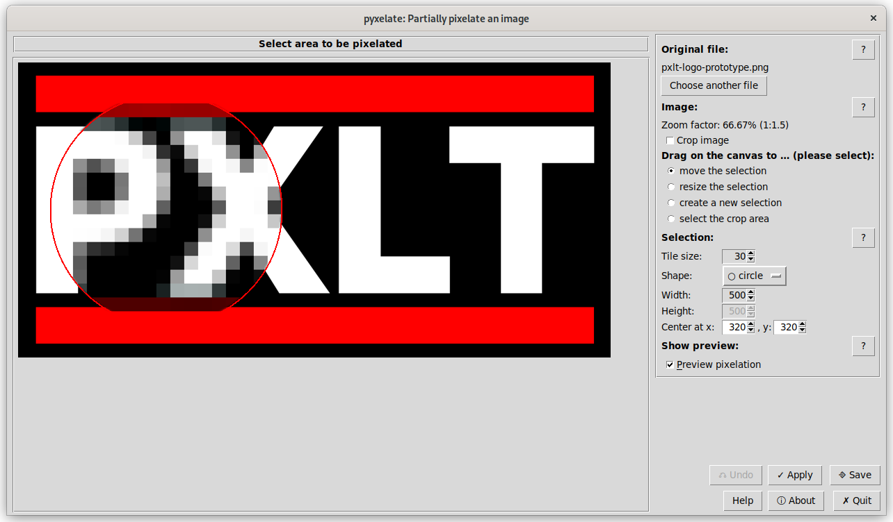

# Pixelate images

The **pixelate_image.py** script provides a GUI
to partially pixelate the selected image.

## Usage

Call **pixelate_image.py** either from the command line or via
context menu from your file manager
(see [file manager integration](./file-manager-integration.md)).

This is an example of the GUI:

In the left panel, the image is loaded, and an indicator is displayed.
You can grab the indicator and drag it around,
or resize it, or create a new selection
(depending on the value of the "Drag on the canvas to" option).

On the right panel, you can choose another image,
or use the controls to fine-tune the pixelation by changing the
tile size and the selection shape, size and position.

The indicator colour options only refer to the visual representation
of the selection and the temporary outline when creating a new selection.
They do not influence the resulting pixelated image.

Loaded images are scaled down to the image panel size automatically if required.
It has a fixed size of 900×640 pixels by default, causing the window
to nearly fill up the screen on my 1366×768 laptop.
If these sizes cause an inappropriate window size for you, you can adjust the
`CANVAS_WIDTH` and `CANVAS_HEIGHT` global variables
in [pixelate_image.py](../pixelate_image.py).

