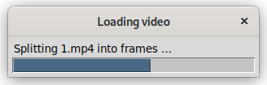
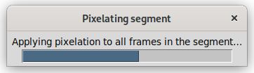
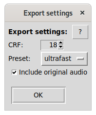

# Pixelate videos

Call **pixelate_video.py** either from the command line or via
context menu from your file manager
(see [file manager integration](./file-manager-integration.md)).

## Basic concepts

### Generic panel behaviour

The application guides you through several panels to specify the pixelation
of one or more (moving) objects in a video.
Clicking anywhere on the canvas with the secondary (usually right) mouse button
is a shortcut for leading you to the follow-up panel.

You can use the "cursor left" (`←`) and "cursor right" (`→`) keys
to move backwards and forwards in the video.

The action determined by the panel will be executed when leaving a panel,
so no extra confirmation is needed.

You can save the video and/or exit the application from any panel.

### Input file handling

The original file will never be overwritten unless you explicitly select that file
in the "Save" file dialog (which will ask you to confirm overwriting an existing file).

After loading a video, it is split up into its single **frames**, that is
25 frames per second of a PAL video, or roughly 30 frames per second of
a NTSC video. Newer cameras might produce even higher rates.

Splitting might take a while, depending on the length and dimensions of the video.

After the video has been split, you can optionally change the desired result
video start and/or end in the first two ("Cut your video: …") panels.

### Routes and segments

A **route** is defined as a sequence of one or more segements connected to each other.

A **segment** defines the linear movement of a pixelation
from an area in a start frame to an area in an end frame.
If the sizes of the start and end area are different, the size of the pixelated
area will be changed linearly as well.

## Detailed panel descriptions

In all panels, the lower two rows of buttons are always clickable.

The `Save` button will lead you to the _"Preview the modified video frame by frame"_
panel if the _"Preview before saving"_ checkbox is checked.
In the other case, it will present the "Export settings" dialog (see below) to you,
export the video to a filename you specify or select in the follow-up
file selection window, and show the exported video in your default player
if you choose to.

`Save and exit` does the same and quits the application directly after.

The `Help` button shows help for the current panel.
`About` lists version and license informatin, and `Quit` exits the application.

### Cut your video: select the beginning of the desired clip

When you select a different frame than the very first one,
all frames before the selected one will be discarded upon leaving this panel.

Click the `Cut end` button to get to the follow-up panel,
or `Add new route` to jump directly to
_"Pixelate a segment: select a start frame and area"_.

### Cut your video: select the end of the desired clip

If you select a different frame than the initial one,
all frames after the selected frame will be cut from the video.

`Add new route` takes you you to the next panel.

### Pixelate a segment: select a start frame and area

Select the start frame and area of the first segment of a pixelation route here.

The area selection works the same way as in [the image pixelation script](./pixelate-images.md).

`Add segment end` takes you to the next panel.

### Pixelate a segment: select an end frame and area

Select the end frame and area of the current segment of the current pixelation route.

After clicking any button except `◁ Back`, the current segment is fully specified,
and is pixelated instantly. Depending on the number of frames in it
and the size of the pixelated area, this might take a while.

When you click the `◁ Back` button, the last pixelation of the current route is undone,
and you are taken back to the panel shown before.

You have two options for continuing if you choose not to save and/or exit yet:
* `Add new route` takes you to the _"Pixelate a segment: select a start frame and area"_
  panel and starts in any frame of the video you choose there.
* `Add connected segment` starts a new segment at the end of the just-finished current segment.
  You stay in the same panel to specify the end of the new segment.

### Preview the modified video frame by frame

You can review the whole clip flip book style here.
In the side bar, the export options (see below) are shown.

If you choose not to save and/or exit yet, you have the same options as in the
_"Pixelate a segment: select an end frame and area"_ panel.

## The "Export settings" dialog

### CRF:

Constant Rate Factor for ffmpeg (0-51).
Higher values produce smaller files at the cost of lower quality.
According to the documentation (https://trac.ffmpeg.org/wiki/Encode/H.264),
a value between 17 and 28 is recommended.

Default is **18**, producing nearly visually lossless output.

### Preset:

FFmpeg preset. Slower presets provide better compression.
According to the documentation (https://trac.ffmpeg.org/wiki/Encode/H.264),
the slowest preset you have patience for is recommended.

Default is **ultrafast**.

### Include original audio:

If selected, the audio stream from the original video
will be included in the exported video.

## Maximum video length

Please note that video length is limited to 10000 frames, that is roughly
5′33″ for NTSC or 6′40″ for PAL videos.
You can extend this limit up to a theoretical value of 999999 frames
(9 hours and 15 minutes for NTSC or 11 hours and 6 minutes for PAL)
by changing the `MAX_NB_FRAMES` variable in the script,
if you have enough disk space and patience for editing such large videos.
